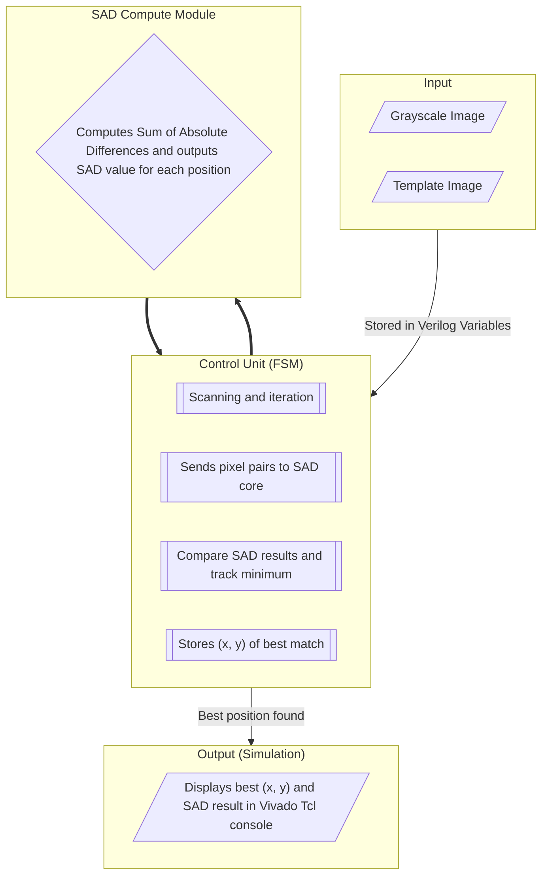
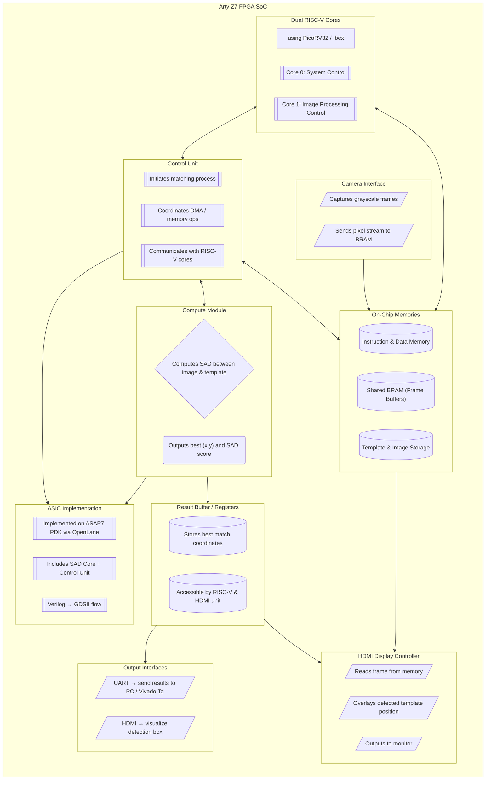

# LOGIC DESIGN PROJECT- Template Matching SoC
CO3091 Logic Design Project Course from HCMUT.
Project using a FPGA Board for Template Matching. 
__________________________________________________
# Block Diagram for the project

## 🧠 Template Matching Core (Simulation Version)

## ✅ Full Advanced Project

